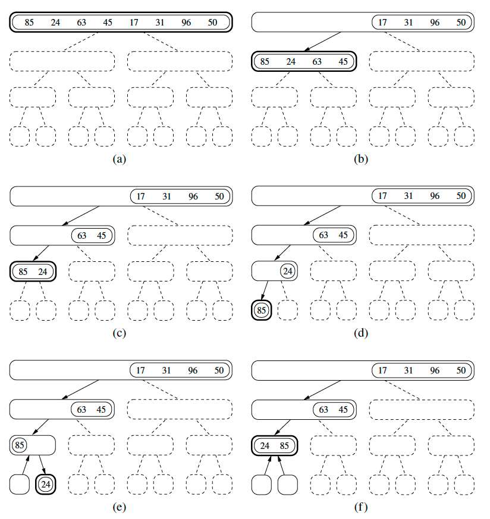
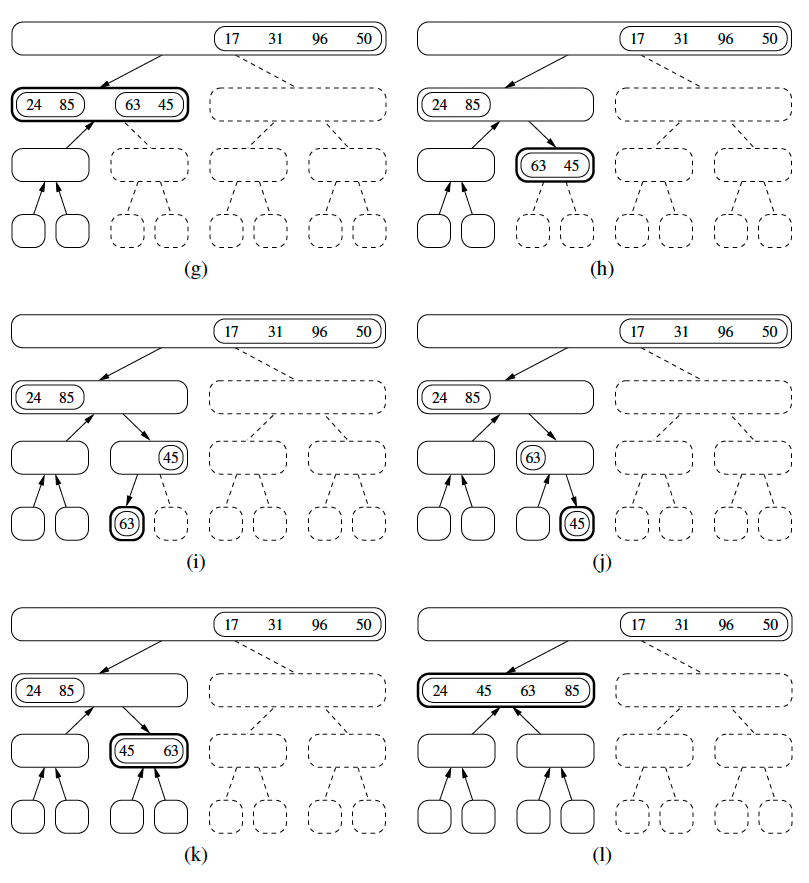
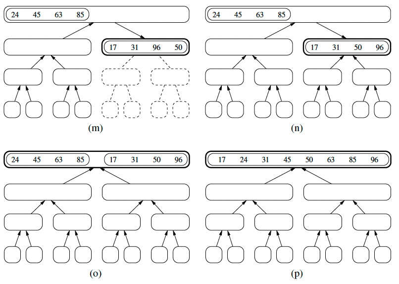

## Sorting

### Merge sort

This uses recursion with a pattern called divide and conquer. This mainly consists of three parts:

- Divide: Divide the input into smaller parts until a certain threshold. In merge sort, if `S` has zero or one element we return the element since its already sorted else we divide `S` into smaller parts namely `S1` and `S2` each having half the number of elements of `S`.
- Conquer: Recursively solve the subsets. In here, recursively sort the subsets `S1` and `S2`
- Combine: Combining the result from each conquer. In here, putting the elements into `S` after sorting `S1` and `S2`

Below is the diagrammatic representation of merge sort;
_Taken from Data Structures and Algorithms in Python Book by Michael T. Goodrich and Roberto Tamassia_

