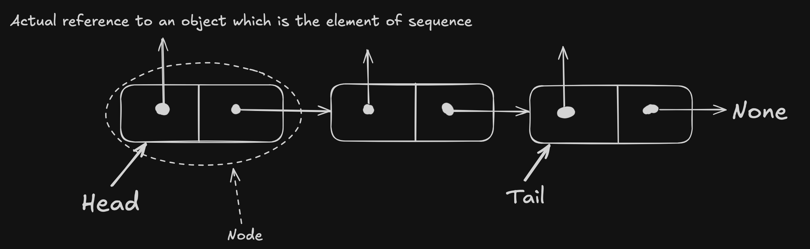
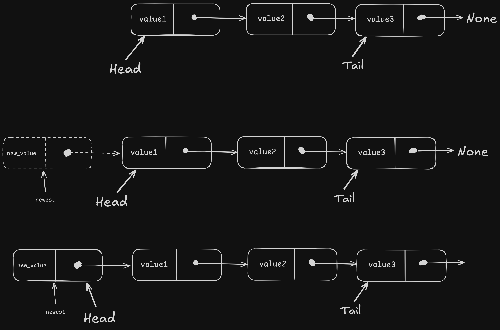
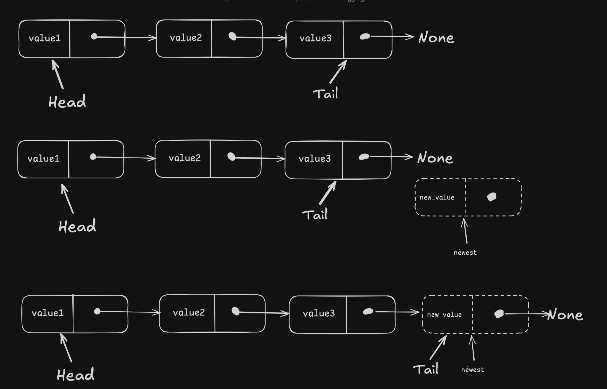
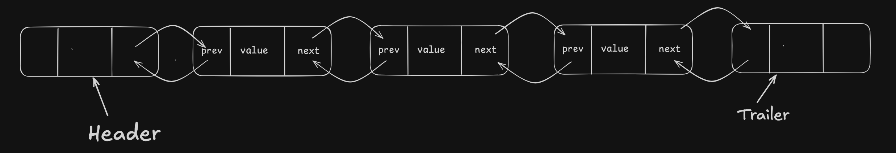
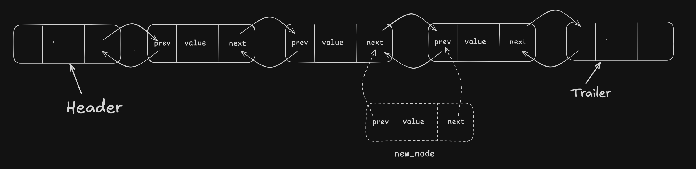

## Singly Linked Lists

In its simplest form is the collection of Nodes that form linear sequence. A Node is reference to an object that is the element of the sequence and reference to the Next Node of the list.
The first and last node of the linked lists are known as Head and Tail. We explicitly maintain Head, Tail and number of nodes(size).
Traversing the linked list is the process of moving from one Node to another by following the next Node's reference.



### Insert an element at the Head

The linked lists do not have fixed sizes, they grow proportionally wrt the elements of the list.

Important steps for inserting

- Create a new node
- Set its element and its next link to the current head of the linked list
- Set the new node as the new head of the linked list.



```
Algorithm add_first(L, e):
    newest = Node(e)
    newest.next = L.head
    L.head = newest
    L.size += 1
```

### Insert an element at the Tail

Important steps for inserting

- Create a new node
- link next element of new node to None
- point current Tail to new node
- set Tail as the new node of LL
- increment size of LL



```
Algorithm add_last(L, e)
    newest = Node(e)
    newest.next = None
    L.tail.next = newest
    L.tail = newest
    L.size += 1
```

### Remove element from Head

Removing is a reverse operation of adding an element to the Head.

steps

- set new head as the next node of the to be removed node
- reduce size

```
Algorithm remove_head(L)
    L.head = L.head.next
    L.size -= 1
```

## Doubly Linked Lists

Doubly linked lists are similar to singly linked lists with an additional reference to the previous node.

### Header & Trailer Sentinels

There are special "dummy" nodes that are present at the both ends of the list: `header` is present at the start of the list and `trailer` is present at the end of the list.



### Inserting and deleting


