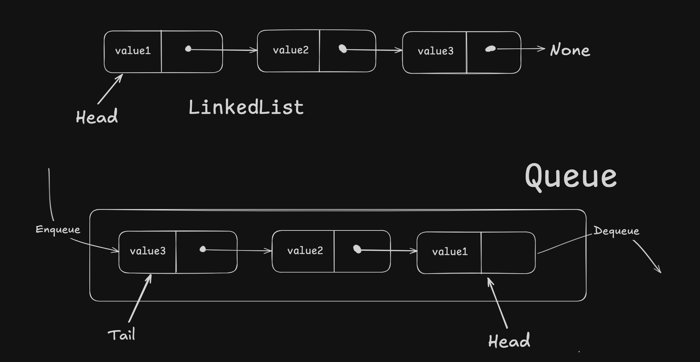

## Queues

Queues work on the principle of **first in, first out (FIFO)**. Elements can be inserted at any given point in time but the element which has been longest in the Q will be removed.
This works just like the Queue in the store where person who came first will leave first once he buys stuff and Queue can go on increasing.

### LinkedList based implementation

In queues we perform operations on both ends so we maintain `head` & `tail` of the linkedlist which corresponds to `front` & `back` of the queue respectively.

| Q Method     | Description                           | Time |
| ------------ | ------------------------------------- | ---- |
| Q.enqueue(e) | add 'e' to back of Q                  | O(1) |
| Q.dequeue(e) | remove 'e' from front of Q            | O(1) |
| Q.first()    | return first elemet of Q w/o removing | O(1) |
| Q.is_empty() | return True if empty                  | O(1) |
| len(Q)       | len of Q                              | O(1) |
