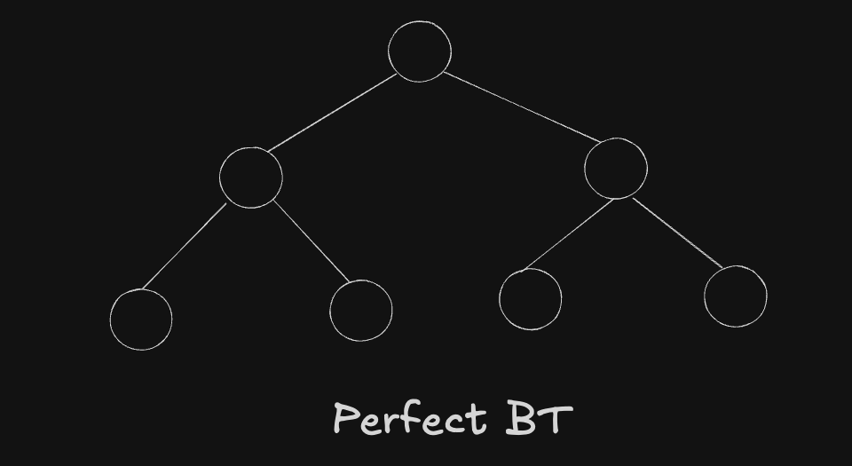
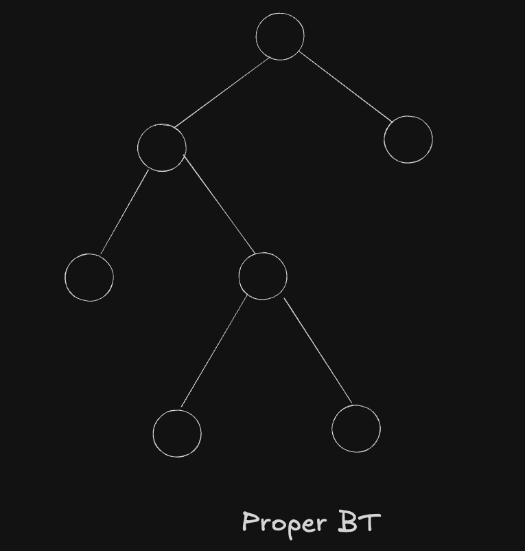
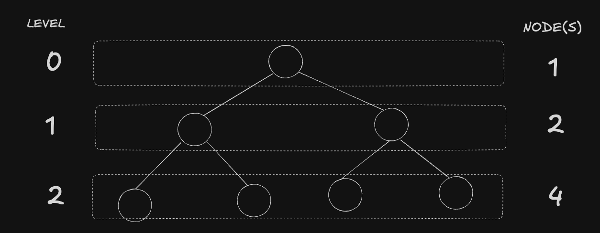
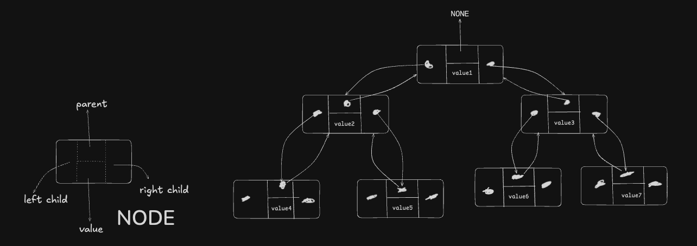

## Trees

A tree is a ADT which stores elements hierarchically. The terms used are related to family tree as well ie "Parent", "Child", "Descendent".
Each element except the Top or Root element has atleast one parent and zero or more children.

Formally trees T is defined as set of nodes storing elements such that nodes have parent-child relationship which satisfies the following properties:

- If T is nonempty then there exists a special node called `root` that has no parent.
- Each node `v` apart from `root` of T has a unique parent `w` & every node with parent `w` is a child of `w`.

Two nodes that have same parent are `siblings`. Node who do not have children are called `external` or `leaves`. Nodes that have one or more children are `internal` nodes.

Edge of T is a pair of nodes (u, v) such that `u` is a parent of `v` or vice-versa.
Path of T is a sequence of nodes such that two consecutive nodes in the sequence form an `edge`.

### Tree ADT operations

A concept of `position` is used as an abstraction for `node` of a T such that positions satisfy parent-child relation which satisfies T structure.

| T Method            | Description                                        | Time |
| ------------------- | -------------------------------------------------- | ---- |
| `p.element()`       | return element stored at position `p`              |      |
| `T.root()`          | return position of root of T or None if empty      |      |
| `T.is_root(p)`      | return True if `p` is the root of the T            |      |
| `T.parent(p)`       | return position of the parent of position `p`      |      |
| `T.num_children(p)` | return number of children of `p`                   |      |
| `T.children(p)`     | generate iteration of the children of `p`          |      |
| `T.is_leaf(p)`      | return True if `p` does not have any children      |      |
| `len(T)`            | return number of elements contained in T           |      |
| `T.is_empty()`      | return if T is empty                               |      |
| `T.positions()`     | generate iteration of all positions of T           |      |
| `iter(T)`           | generate iteration of all elements stored within T |      |

These are just the Accessor methods. The T update and create methods are added later wrt the specific implementation of T.

We first create Abstract Base Class of a `Tree` and then each implementation will be subclass of this Base Class which should override abstract methods.

## Binary Trees

A binary tree has following properties:

- Every node has atmost two children
- Each node is labelled as right or left child

A subtree rooted at left or right child of node `v` is called left subtree or right subtree respectively of the node `v`.

A BT is `perfect` if each node has zero or two children and bottom layer is completely filled.

A BT is `proper` if each node has zero or two children. This is also called `full` BT.

### Operations

In addition to Tree's accessor methods, BT supports three additional methods

| T Method       | Description                                                           | Time |
| -------------- | --------------------------------------------------------------------- | ---- |
| `T.left(p)`    | return the position of the left child of `p`. None if no left child   | O(1) |
| `T.right(p)`   | return the position of the right child of `p`. None if no right child | O(1) |
| `T.sibling(p)` | return the position of the sibling of `p`. None if no sibling         | O(1) |

### Properties

In a BT
level 0 has atmost 1 node ie root
level 1 has atmost 2 nodes
level 2 has atmost 4 nodes

- So it comes to the fact that any given level `d` has atmost 2d nodes.
- In non empty T, the no of external nodes (nE) and no of internal nodes (nI) we can say `nE = nI + 1`. In the given example, `nE` = 4 & `nI` = 3. so `4 = 3 + 1`

### Implementation

#### Linked Binary Tree

A binary tree is naturally represented with a linked structure. The node stores the references of the parent and left & right children nodes and the element stored at p. The root node does not have a parent so the reference to the parent is None. Similarly if node does not have left or right child then respective references are None.
The Tree's instance variable stores reference to the root and size of the nodes.

##### Update methods

Our constructor initializes an empty tree and the update methods vary with the Tree implmentation. So here are the update methods supported for Linked Binary Tree
| T Method | Description | Time |
| -------------- | --------------------------------------------------------------------- | ---- |
| `T.add_root(e)` | Create root for an empty tree with `e` as the value and return the position of root. Throw error if T is non empty | O(1) |
| `T.add_left(p, e)` | Create a new node with value `e` and link it as the left child of position `p`, return the new position. Throw an error if `p` already has left child | O(1) |
| `T.add_right(p, e)` | Create a new node with value `e` and link it as the right child of position `p`, return the new position. Throw an error if `p` already has right child | O(1) |
| `T.replace(p, e)` | Replace element stored at position `p` with `e` and return previously stored element. | O(1) |
| `T.delete(p)` | Remove the node at position `p` and replace it with its child if any. Throw an error if `p` has two children. Return new element stored at `p`. | O(1) |
